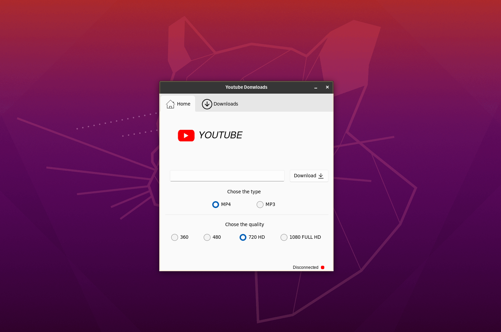

# Youtube Downloader
 Aplicativo para download de vídeos e músicas do youtube feito com tkinter
 
 NB: Em desenvolvimento

## Pré-requisitos

Antes de começar, verifique se você atendeu aos seguintes requisitos:

* Você instalou o python 3.+ ou posterior.
* Você tem uma máquina `Windows ou Linux`.
* Você leu a documentação do [Tkinter](https://docs.python.org/3/library/tkinter.html). (opcional)

## Preparando o ambiente
No terminal ou cmd digite:
```
pip install -r requirements.txt
```

## Iniciando o programa

Para iniciar, siga estas etapas no diretório raiz:

Linux e macOS:
```
python3 main.py
```

Windows:
```
python main.pyw
```
## Exemplo




## Colaboradores

Obrigado às seguintes pessoas que contribuíram para este projeto:

* [@sweydmanaf](https://github.com/sweydmanaf) 📖


## Contato

Se quiser entrar em contato comigo, você pode entrar em contato comigo em <abdulsweyd@gmail.com>.


